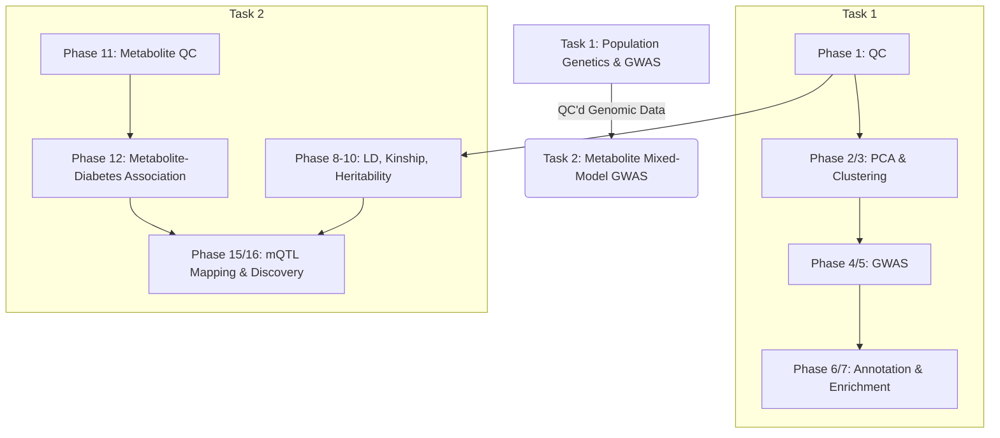

# Bioinformatics Pipeline Portfolio & Tutorial

Welcome to my Bioinformatics Pipeline Repository! This repository contains a complete, 16-phase bioinformatics workflow starting from raw genomic data quality control all the way to advanced metabolite-QTL (mQTL) mapping and pathway enrichment.

I have structured this repository not just as a showcase of my code, but as a **tutorial** to help you understand the *biology* and *methodology* behind each step of a modern Genome-Wide Association Study (GWAS).

## 🧬 Pipeline Overview

## 📚 Curriculum & Content

The tutorial is split into two major tasks. Click on the links below to dive into the code, explanations, and outputs for each phase.

### [Task 1: Population Genetics & GWAS Pipeline](Task1_Population_Genetics.md)
*   **Phase 1:** Quality Control (QC) of genomics data
*   **Phase 2:** Principal Component Analysis (Population Structure)
*   **Phase 3:** Identify sub-population structure (Clustering)
*   **Phase 4:** SNP Association with population structure (Linear Model)
*   **Phase 5:** SNPs Associated with Sex (Logistic Model)
*   **Phase 6:** Gene and functional Annotation
*   **Phase 7:** Pathway Enrichment Analysis

### [Task 2: Kinship, Heritability, and Metabolite Mixed-Model GWAS](Task2_Metabolite_GWAS.md)
*   **Phase 8-10:** Linkage Disequilibrium, Kinship Matrix, and Heritability
*   **Phase 11-13:** Metabolite Data QC, Phenotype Association, and Classification
*   **Phase 14:** Partial Correlation Network of Metabolites
*   **Phase 15:** SNP–Metabolite Association (mQTL) Mapping
*   **Phase 16:** Metabolite Functional and Pathway Association Discovery

## 🛠️ Core Tools Used
*   **Genetics:** `PLINK 1.9 / 2.0`, `GCTA`
*   **Data Science (R):** `tidyverse`, `ggplot2`, `clusterProfiler`, `biomaRt`, `sommer`, `qqman`

---
*Created as part of an intensive bioinformatics training internship.*
