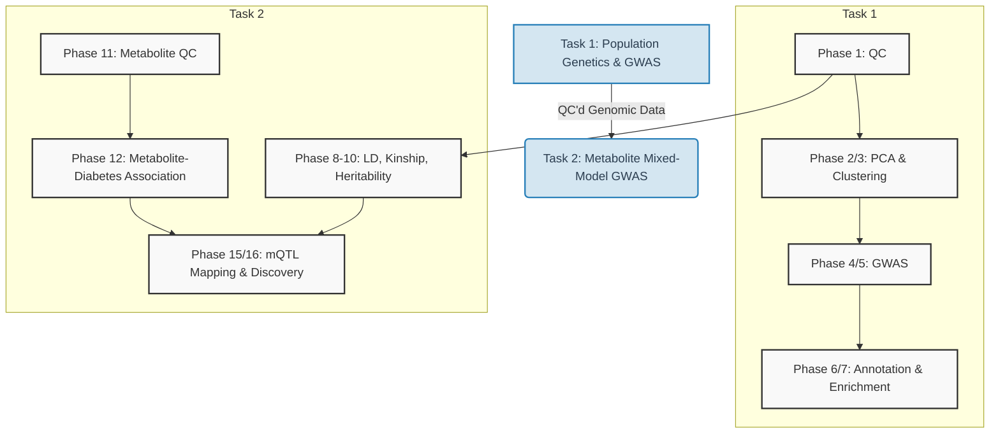

<div align="center">
  
  
  
  <br/>
[]()
[]()
[]()
[]()
[]()
[](https://opensource.org/licenses/MIT)

# 🧬 Bioinformatics Pipeline Portfolio & Tutorial

*A complete, 16-phase bioinformatics workflow starting from raw genomic data quality control to advanced metabolite-QTL (mQTL) mapping and pathway enrichment.*

</div>

---

<div align="center">

### ✨ Key Highlights

| | |
|:---|:---|
| 🧬 **156 Qatari genome samples** with 67,735+ QC'd SNPs | 🔬 **16-phase pipeline** from raw QC → mQTL discovery |
| 🤖 **ML classification** with AUC = 1.0 for T2D metabolite prediction | 📊 **Fully reproducible** R + PLINK + GCTA code with annotated outputs |
| 📖 **Educational tutorial** — each phase explains the biology & methodology | 🌐 **Multi-omics integration** — genomics × metabolomics × pathway analysis |

</div>

---

> [!NOTE]
> I have structured this repository not just as a showcase of my code, but as a **tutorial** to help you understand the *biology* and *methodology* behind each step of a modern Genome-Wide Association Study (GWAS).

## 🛠️ Technologies & Tools

<div align="center">

| Category | Tools |
| :--- | :--- |
| **Languages** | R, Bash |
| **Genomics** | PLINK 1.9 / 2.0, GCTA, KING |
| **Visualization** | ggplot2, qqman, pheatmap, igraph |
| **Annotation** | biomaRt (Ensembl), clusterProfiler, org.Hs.eg.db |
| **Machine Learning** | randomForest, caret, Elastic Net |
| **Statistics** | regress (REML), ppcor, sommer |
| **Data Wrangling** | dplyr, data.table, tidyverse |

</div>

---

## 📑 Table of Contents
- [🛠️ Technologies & Tools](#️-technologies--tools)
- [🧬 Pipeline Overview](#-pipeline-overview)
- [🖼️ Sample Outputs](#️-sample-outputs)
- [📚 Curriculum & Content](#-curriculum--content)
  - [Task 1: Population Genetics & GWAS](#task-1-population-genetics--gwas-pipeline)
  - [Task 2: Kinship, Heritability, and Metabolite GWAS](#task-2-kinship-heritability-and-metabolite-mixed-model-gwas)
- [📂 Repository Structure](#-repository-structure)
- [🚀 Quick Start](#-quick-start)
- [👨‍💻 Author](#-author)

---

## 🧬 Pipeline Overview

The pipeline is split into two interconnected tasks. Task 1 focuses on population genetics and basic GWAS, while Task 2 incorporates complex trait analysis via mixed models.



---

## 🖼️ Sample Outputs

<div align="center">
  <table>
    <tr>
      <td align="center">
        
        <br/><em>Population Structure via PCA</em>
      </td>
      <td align="center">
        
        <br/><em>Annotated Manhattan Plot for PC1</em>
      </td>
    </tr>
    <tr>
      <td align="center">
        
        <br/><em>Metabolite Partial Correlation Network</em>
      </td>
      <td align="center">
        
        <br/><em>Adjusted mQTL Manhattan Plot</em>
      </td>
    </tr>
  </table>
</div>

---

## 📚 Curriculum & Content

### [Task 1: Population Genetics & GWAS Pipeline](Task1_Population_Genetics.md)

| Phase | Name | Key Output | Status |
| :---: | :--- | :--- | :---: |
| **1** | Quality Control (QC) | Cleaned PLINK binaries | ✅ |
| **2** | Principal Component Analysis | PCA Eigenvectors | ✅ |
| **3** | Sub-population Clustering | Cluster Assignments | ✅ |
| **4** | Structure Association | Linear Model SumStats | ✅ |
| **5** | Sex Association | Logistic Model SumStats | ✅ |
| **6** | Functional Annotation | Gene/Variant Mapping | ✅ |
| **7** | Pathway Enrichment | Over-represented Pathways | ✅ |

> [!TIP]
> Task 1 builds the foundation. Understanding population structure (Phases 2-3) is critical to avoiding confounding in your final GWAS!

### [Task 2: Kinship, Heritability, and Metabolite Mixed-Model GWAS](Task2_Metabolite_GWAS.md)

| Phase | Name | Key Output | Status |
| :---: | :--- | :--- | :---: |
| **8** | Linkage Disequilibrium | LD Heatmaps | ✅ |
| **9** | Kinship Matrix | GRM Matrix | ✅ |
| **10** | Heritability Estimation | $h^2$ Estimates | ✅ |
| **11** | Metabolite Data QC | Normalized Metabolites | ✅ |
| **12** | Phenotype Association | Volcano Plots | ✅ |
| **13** | Feature Classification | Variable Importance | ✅ |
| **14** | Correlation Network | Network Graph | ✅ |
| **15** | mQTL Mapping | GWAS Summary Statistics | ✅ |
| **16** | Functional Discovery | Annotated mQTL Pathways | ✅ |

> [!IMPORTANT]
> In Task 2, we use a mixed-model approach incorporating the Genetic Relationship Matrix (GRM) from Phase 9 to properly account for cryptic relatedness when mapping mQTLs.

---

## 📂 Repository Structure

```
bioinformatics_portfolio/
├── 📄 README.md                    # You are here
├── 📄 Task1_Population_Genetics.md  # Phases 1-7 tutorial & results
├── 📄 Task2_Metabolite_GWAS.md      # Phases 8-16 tutorial & results
├── 🖼️ banner.jpg                    # Repository banner image
├── 📜 scripts/                      # All analysis code
│   ├── Task1_Phases1to7.R           # QC → PCA → GWAS → Annotation → Enrichment
│   ├── Task2_Phase8_LD.R            # Linkage Disequilibrium analysis
│   ├── Task2_Phase9_Kinship.R       # Kinship & GRM estimation
│   ├── Task2_Phase10_Heritability.R # SNP-heritability estimation
│   ├── Task2_Phase11_MetabQC.R      # Metabolomics quality control
│   ├── Task2_Phase12_Association.R  # Metabolite-T2D association
│   ├── Task2_Phase13_Classification.R # ML diabetes classification
│   ├── Task2_Phase14_Network.R      # Partial correlation networks
│   ├── Task2_Phase15_mQTL.R         # Mixed-model mQTL mapping
│   ├── Task2_Phase16_Pathway.R      # Pathway enrichment & discovery
│   ├── LD_decay_genomewide.sh       # Genome-wide LD decay calculation
│   └── LD_decay_plot.R              # LD decay visualization
└── 📊 outputs/                      # All generated results
    ├── Phase1_QC/                   # QC histograms & reports
    ├── Phase2_PCA/                  # PCA scatter & scree plots
    ├── ...                          # (16 phase directories total)
    └── Phase16_Pathway/             # Pathway enrichment results
```

---

## 🚀 Quick Start

<details>
<summary><b>Click here to view setup instructions</b></summary>
<br>

To get started with running this pipeline locally, follow these steps:

1. **Clone the repository**
   ```bash
   git clone https://github.com/omarAhmedFathi/Bioinformatics-Training.git
   cd Bioinformatics-Training
   ```

2. **Install Dependencies**
   Ensure you have `PLINK 1.9`, `GCTA`, and `R` (≥ 4.0) installed. Then install all R packages in one go:
   ```bash
   Rscript scripts/requirements.R
   ```
   Or install manually inside R:
   ```R
   install.packages(c("tidyverse", "ggplot2", "sommer", "qqman"))
   BiocManager::install(c("clusterProfiler", "biomaRt"))
   ```

3. **Run Pipeline Scripts**
   Execute the R and Bash scripts in phase order from the `scripts/` directory.

</details>

---

## 👨‍💻 Author

<div align="center">

**Omar Ahmed**  
*Bioinformatics Developer & Researcher*

[](https://github.com/omarAhmedFathi)
[](https://linkedin.com/in/)

*Created as part of an intensive bioinformatics training internship.*

---

⭐ If you found this useful, please consider giving this repository a star!

</div>
