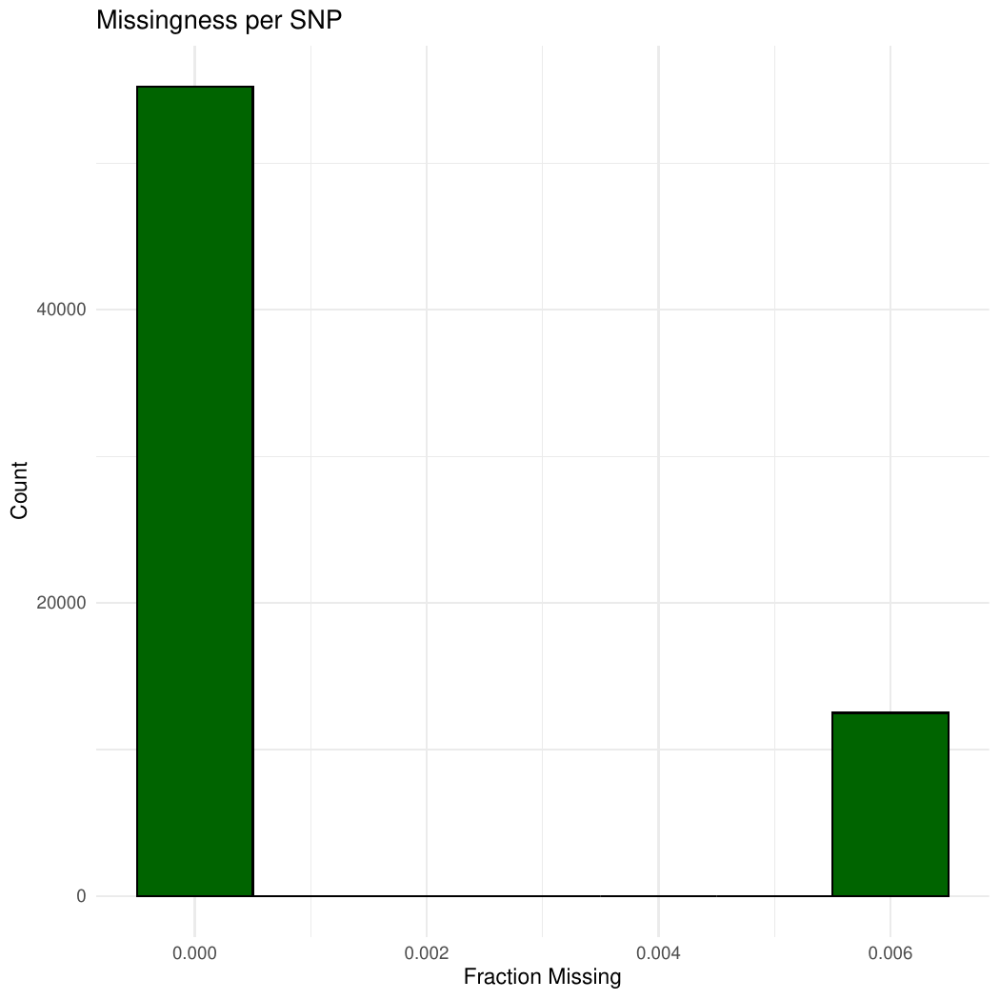
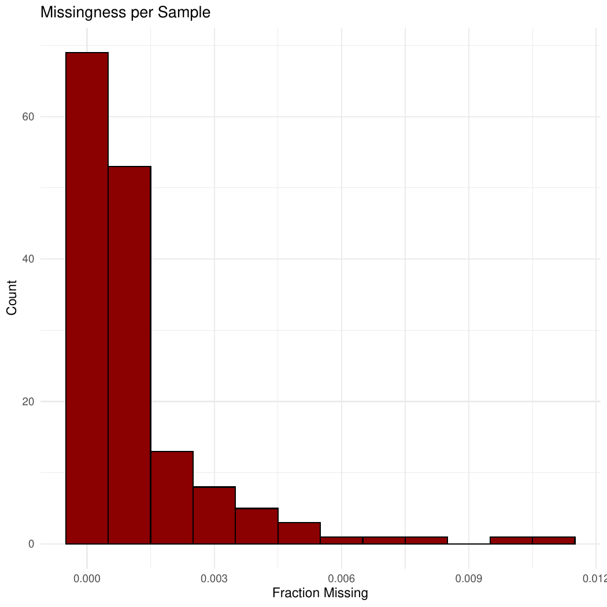
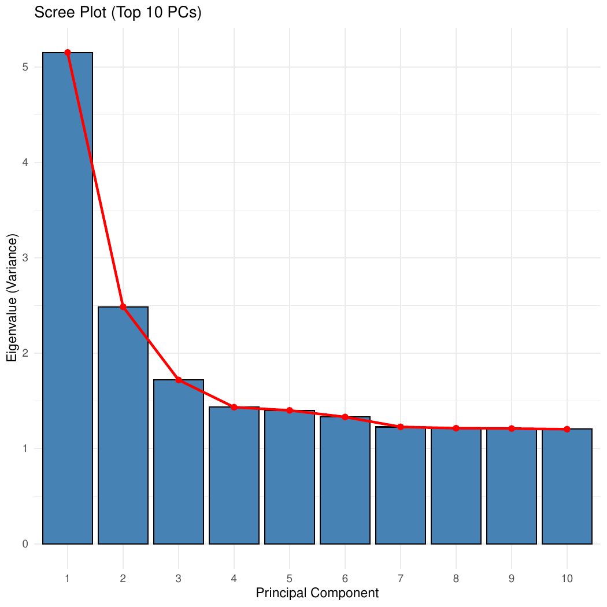
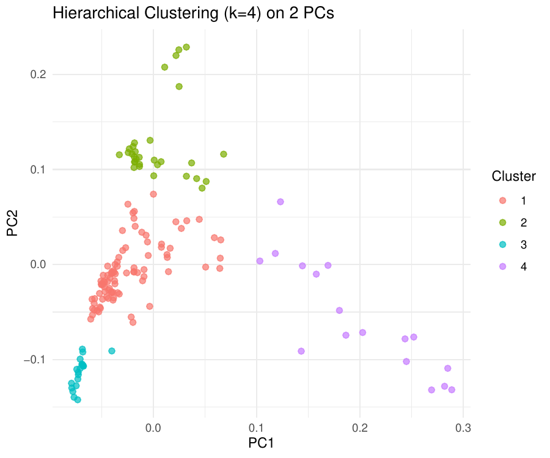
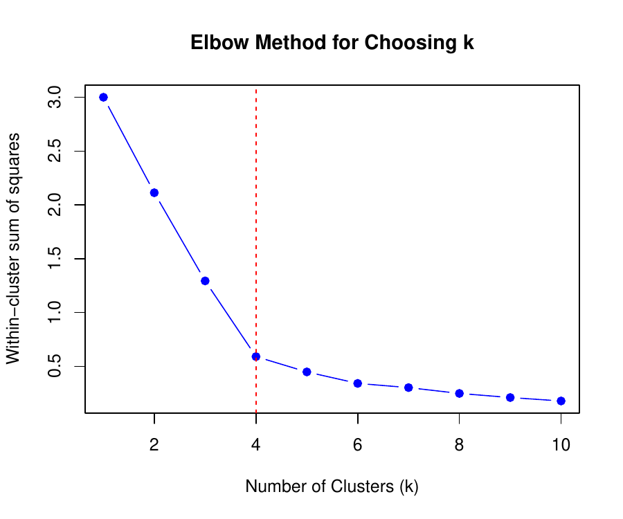
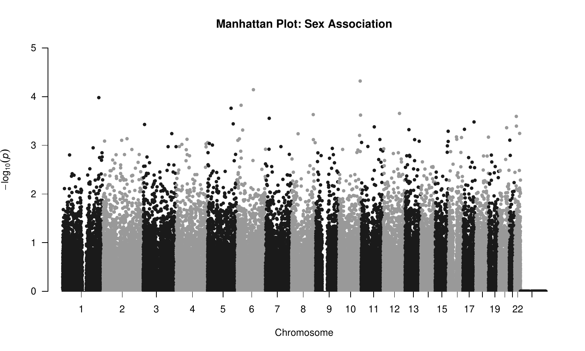
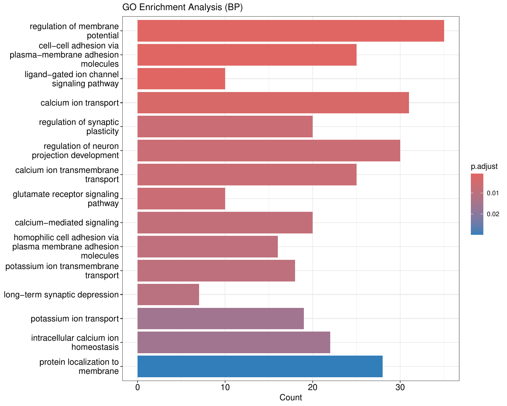

[← Back to Main README](./README.md)

<div align="center">

# 🧬 Population Genetics & GWAS Pipeline: Qatari Cohort

  

</div>

Welcome to this comprehensive tutorial and report on a 7-phase bioinformatics Genome-Wide Association Study (GWAS) pipeline. We are analyzing a Qatari cohort containing **156 samples** and **67,735 SNPs**. 

This document breaks down the analysis phase by phase. For each phase, we cover the underlying biology (the *why*), the methodology (the *how*), the code used, the generated outputs, and our interpretations.

<div align="center">


</div>

---

## 📑 Table of Contents

- [🛠️ Phase 1: Quality Control (QC)](#️-phase-1-quality-control-qc)
- [📊 Phase 2: Principal Component Analysis (PCA)](#-phase-2-principal-component-analysis-pca)
- [🧩 Phase 3: Clustering](#-phase-3-clustering)
- [📈 Phase 4: GWAS Quantitative (PC1 as phenotype)](#-phase-4-gwas-quantitative-pc1-as-phenotype)
- [🧬 Phase 5: GWAS Sex (logistic)](#-phase-5-gwas-sex-logistic)
- [🏷️ Phase 6: Annotation](#️-phase-6-annotation)
- [🌐 Phase 7: Pathway Enrichment](#-phase-7-pathway-enrichment)

---

## 🛠️ Phase 1: Quality Control (QC)

> [!IMPORTANT]
> **Biology & Rationale:** Quality control is the crucial first step in any genomic analysis. Sequencing errors, low-quality DNA, or technical artifacts can introduce false positives or mask true biological signals. We filter out rare variants (using Minor Allele Frequency, MAF), poorly genotyped SNPs (SNP missingness), and poorly genotyped individuals (Sample missingness) to ensure our dataset is robust and reliable.

### The Code

<details><summary>🔧 View R Code</summary>

```R
library(ggplot2)

# 1. Minor Allele Frequency (MAF)
freq <- read.table("../intermediate/phase1_freq.frq", header=TRUE)
cat("Min MAF:", min(freq$MAF, na.rm=TRUE), "\n")
cat("Max MAF:", max(freq$MAF, na.rm=TRUE), "\n")

ggplot(freq, aes(x=MAF)) + 
  geom_histogram(binwidth=0.01, fill="steelblue", color="black") + 
  theme_minimal() + 
  labs(title="Minor Allele Frequency Distribution", x="MAF", y="Count")

# 2. SNP Missingness
lmiss <- read.table("../intermediate/phase1_missing.lmiss", header=TRUE)
ggplot(lmiss, aes(x=F_MISS)) + 
  geom_histogram(binwidth=0.001, fill="darkgreen", color="black") + 
  theme_minimal() + 
  labs(title="SNP Missingness", x="Fraction Missing", y="Count")

# 3. Sample Missingness
imiss <- read.table("../intermediate/phase1_missing.imiss", header=TRUE)
ggplot(imiss, aes(x=F_MISS)) + 
  geom_histogram(binwidth=0.001, fill="darkred", color="black") + 
  theme_minimal() +
  labs(title="Sample Missingness", x="Fraction Missing", y="Count")
```

</details>

### Outputs & Interpretation

> [!NOTE]
> **QC Filtering Summary:** The dataset was already pre-filtered to high quality, as evidenced by the minimal data loss under standard thresholds.

| Filter | Command | Retained SNPs | Retained Samples |
| :--- | :--- | :--- | :--- |
| **Standard filter** | `--maf 0.05 --geno 0.05 --hwe 1e-6` | 67,735 | 156 |
| **Stricter MAF** | `--maf 0.10` | 51,129 | - |
| **Stricter geno** | `--geno 0.01` | 67,735 | - |

<br>

<div align="center">


*Fig 1.1: Minor Allele Frequency Distribution*


*Fig 1.2: SNP Missingness Distribution*


*Fig 1.3: Sample Missingness Distribution*

</div>

*Interpretation:* The minimal loss of SNPs under stricter genotype missingness limits shows the genotypic data is of high quality. The MAF distribution shows an expected skew toward lower frequencies, but restricting to `> 0.05` ensures we have sufficient statistical power for downstream associations without extreme rare-variant noise.

---

## 📊 Phase 2: Principal Component Analysis (PCA)

> [!TIP]
> **Biology & Rationale:** Human populations have complex demographic histories involving migrations, bottlenecks, and admixture. This creates population stratification—systematic allele frequency differences between subpopulations. PCA captures the major axes of genetic variation, which usually correlate with geography or ancestry. By using principal components as covariates in a GWAS, we control for this structure and prevent spurious associations.

### The Code

<details><summary>🔧 View R Code</summary>

```R
library(ggplot2)

# Load eigenvectors (PCs) and eigenvalues
eigenvec <- read.table("../intermediate/pca_results.eigenvec", header=FALSE)
colnames(eigenvec) <- c("FID", "IID", paste0("PC", 1:10))

eigenval <- read.table("../intermediate/pca_results.eigenval", header=FALSE)
pve <- data.frame(PC = 1:nrow(eigenval), PVE = eigenval$V1 / sum(eigenval$V1) * 100)

# PCA Scatter Plot
ggplot(eigenvec, aes(x=PC1, y=PC2)) + 
  geom_point(alpha=0.7, color="purple") + 
  theme_minimal() +
  labs(title="PCA: PC1 vs PC2")

# Scree Plot
ggplot(pve[1:10,], aes(x=factor(PC), y=PVE)) + 
  geom_col(fill="coral") + 
  theme_minimal() + 
  labs(title="Scree Plot: Proportion of Variance Explained", x="Principal Component", y="% Variance Explained")
```

</details>

### Outputs & Interpretation

<div align="center">


*Fig 2.1: PCA Scatter Plot of PC1 vs PC2*


*Fig 2.2: Scree Plot showing variance explained by top 10 PCs*

</div>

*Interpretation:* The scatter plot of PC1 vs. PC2 visualizes the genetic landscape of our cohort, highlighting underlying ancestral diversity. The scree plot shows the variance explained by each PC; typically, the first few PCs capture the bulk of population structure, flattening out at subsequent components.

---

## 🧩 Phase 3: Clustering

> [!IMPORTANT]
> **Biology & Rationale:** While PCA provides continuous axes of variation, clustering groups individuals into discrete sub-populations. Identifying these sub-populations helps in conducting stratified analyses or simply understanding the demographic composition of our cohort.

### Outputs & Interpretation

For clustering, we utilized the Ward.D2 hierarchical clustering method alongside DBSCAN, selecting `k=4` based on the Elbow Method. 

> [!NOTE]
> Only 4 out of 156 samples shifted their cluster assignments when comparing a 2-PC model against a 3-PC model, demonstrating the stability of our primary genetic clusters.

<div align="center">


*Fig 3.1: Cluster assignments based on 2 Principal Components*


*Fig 3.2: Cluster assignments based on 3 Principal Components*


*Fig 3.3: Elbow plot for optimal k determination*

</div>

*Interpretation:* The elbow plot strongly suggests 4 clusters as the optimal trade-off between variance explained and model complexity. The consistency between 2PC and 3PC cluster allocations means that the first two components contain the vast majority of the discriminating information for these subgroups.

---

## 📈 Phase 4: GWAS Quantitative (PC1 as phenotype)

> [!TIP]
> **Biology & Rationale:** We use PC1 as a quantitative phenotype to discover which specific genetic variants (SNPs) drive the primary axis of population structure in this cohort. SNPs highly associated with PC1 are Ancestry Informative Markers (AIMs).

### Output Data

| CHR | SNP | BP | A1 | TEST | NMISS | BETA | STAT | P |
| :---: | :---: | :---: | :---: | :---: | :---: | :---: | :---: | :---: |
| 1 | rs10907175 | 1120590 | C | ADD | 156 | -0.009401 | -0.5808 | 0.5623 |
| 1 | rs7519837 | 1500664 | T | ADD | 155 | 0.0534 | 6.56 | **8.879e-10** |
| 1 | rs10907187 | 1748914 | A | ADD | 156 | 0.001942 | 0.1816 | 0.8562 |
| 1 | rs6603803 | 1802548 | G | ADD | 156 | -0.03613 | -3.862 | 0.0001683 |

*Interpretation:* The output reveals highly significant SNPs, such as `rs7519837` with a P-value of `8.879e-10`. These highly significant markers are the major contributors pulling individuals along the PC1 axis, acting as strong indicators of the population structure differences.

---

## 🧬 Phase 5: GWAS Sex (logistic)

> [!WARNING]
> **Biology & Rationale:** Running a GWAS using biological sex as a binary phenotype acts as a vital sanity check for the pipeline. We expect no significant associations on autosomal chromosomes, as alleles are inherited randomly independent of sex. 

### Outputs & Interpretation

- **Cohort Breakdown:** Males = 49, Females = 107
- **Findings:**
  - **Zero** genome-wide significant autosomal SNPs (Bonferroni threshold = 7.3e-7).
  - No Y chromosome variants were present in the dataset.
  - X chromosome SNPs showed no association under an additive model. This is because males and females have the same underlying allele frequencies—the true biological difference is hemizygosity (one X in males) versus heterozygosity (two Xs in females).

> [!CAUTION]
> If significant autosomal hits were found here, it would indicate a massive batch effect (e.g., males and females were genotyped on different plates with different error rates) or sample mix-ups. The null result confirms our QC is solid!

---

## 🏷️ Phase 6: Annotation

> [!TIP]
> **Biology & Rationale:** Once we identify significantly associated SNPs, we need to map them to functional genomic elements, like genes or regulatory regions, to understand their biological impact. We query Ensembl using `biomaRt` to map coordinates to gene symbols.

### Outputs & Interpretation

We visualize the distribution of associations across the genome using Manhattan plots, highlighting the genes associated with top SNPs.

<div align="center">


*Fig 6.1: Manhattan Plot with PC1 associations mapped to genes*


*Fig 6.2: Manhattan Plot for Sex GWAS sanity check*

</div>

*Interpretation:* The PC1 Manhattan plot shows distinct "towers" of significance—these loci harbor the Ancestry Informative Markers. The Sex GWAS plot is flat, as expected, reinforcing our sanity check. By mapping these SNPs to genes, we lay the groundwork for understanding the functional pathways involved.

---

## 🌐 Phase 7: Pathway Enrichment

> [!IMPORTANT]
> **Biology & Rationale:** Single genes rarely act in isolation. Pathway enrichment analysis groups associated genes into biological networks or Gene Ontology (GO) terms to see if specific biological processes are over-represented in our GWAS hits.

### The Findings

Using `clusterProfiler` with the `org.Hs.eg.db` database, we discovered enriched pathways. Here are the top Gene Ontology (GO) results:

| GO Term | Pathway / Biological Process | P-Value | Overlapping Genes |
| :--- | :--- | :--- | :--- |
| **GO:0042391** | regulation of membrane potential | 2.16e-07 | 35 / 530 |
| **GO:0098742** | cell-cell adhesion via plasma-membrane adhesion molecules | 3.64e-07 | 25 / 530 |
| **GO:1990806** | ligand-gated ion channel signaling pathway | 5.74e-07 | 10 / 530 |
| **GO:0006816** | calcium ion transport | 2.74e-06 | 31 / 530 |

### Outputs & Interpretation

<div align="center">


*Fig 7.1: Dotplot of top enriched Gene Ontology terms*


*Fig 7.2: Barplot of top enriched Gene Ontology terms*

</div>

*Interpretation:* The enriched pathways, such as membrane potential regulation and ion channel signaling, suggest that the population differences captured by PC1 may be biologically rooted in specific physiological adaptations or historical selection pressures on these neuro-cellular processes within the Qatari subgroups. This translates statistical associations into meaningful biological hypotheses!

---

[← Back to Main README](./README.md)
