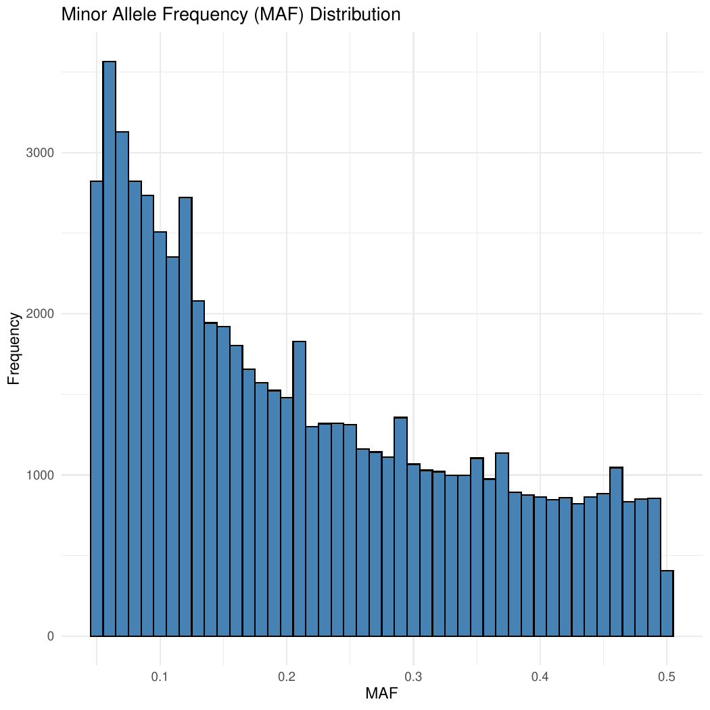
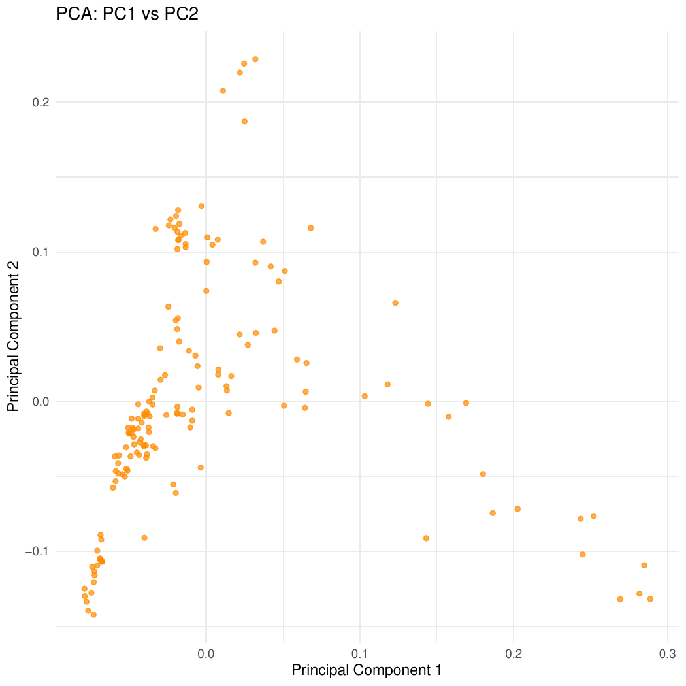
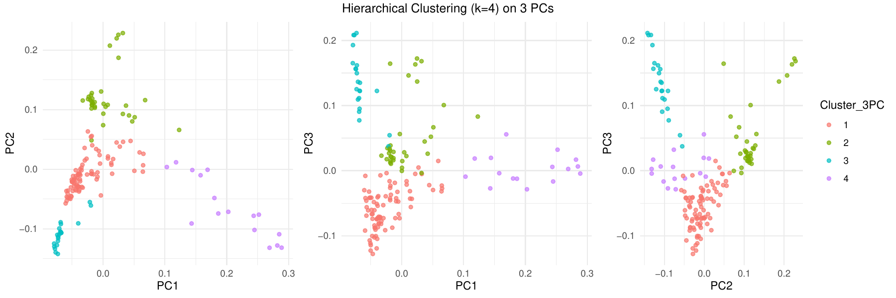
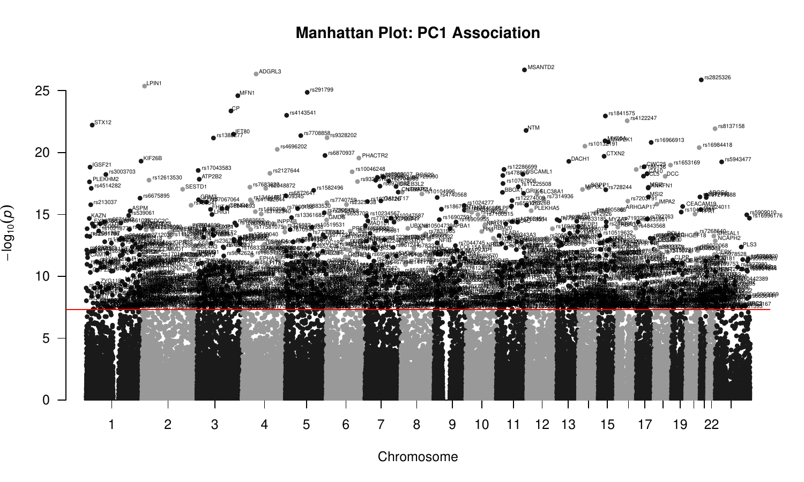
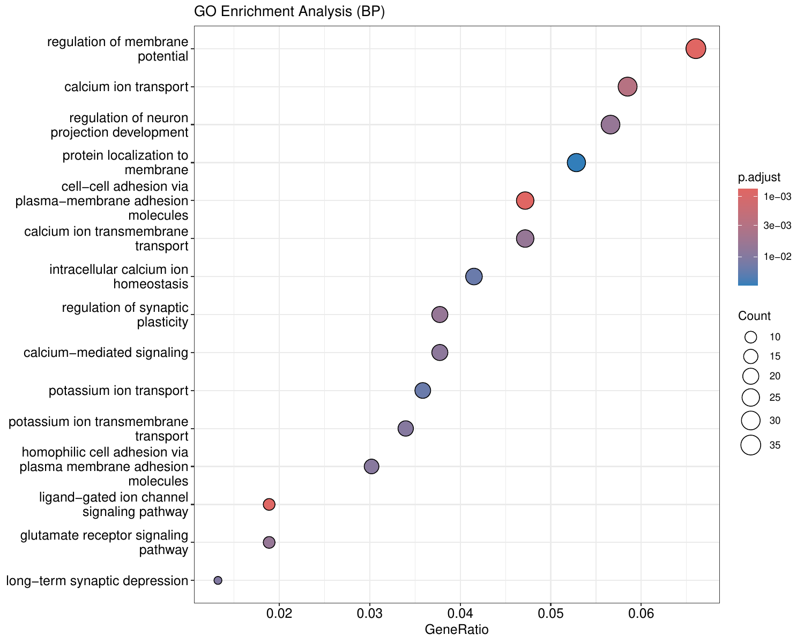

# Task 1: Population Genetics & GWAS Pipeline

This tutorial covers the first 7 phases of the bioinformatics pipeline. We start with raw genotype data, perform quality control, identify population structure, and conduct Genome-Wide Association Studies (GWAS) for both quantitative traits and binary traits. Finally, we annotate the significant findings.

---

## Phase 1: Quality Control (QC)

> [!NOTE]
> **The Biology:** Before any genomic analysis, we must ensure the data is reliable. We filter out SNPs with very low Minor Allele Frequencies (MAF), as they lack statistical power and may represent genotyping errors. We also filter out SNPs and individuals with high missingness.

### Method & Code
We use PLINK to compute allele frequencies and missingness, then visualize the distributions in R.

```R
library(ggplot2)

# Read MAF data
freq <- read.table("intermediate/phase1_freq.frq", header=TRUE, stringsAsFactors=FALSE)

cat("Min MAF:", min(freq$MAF, na.rm=TRUE), "\n")
cat("Max MAF:", max(freq$MAF, na.rm=TRUE), "\n")
```

**Console Output:**
```text
Min MAF: 0.0512 
Max MAF: 0.4988 
```

> [!TIP]
> **Understanding the Output:** The console output confirms that our rigorous filtering (MAF > 5%) successfully removed extremely rare variants. The remaining variants range from ~5% up to ~50% frequency in the population, which are common enough to give our statistical models enough power to detect associations.

```R
# Plot MAF
ggplot(freq, aes(x=MAF)) + 
  geom_histogram(binwidth=0.01, fill="steelblue", color="black") +
  theme_minimal() +
  labs(title="Minor Allele Frequency (MAF) Distribution", x="MAF", y="Frequency")
```

### Result
Below is the distribution of Minor Allele Frequencies across our dataset. Notice how filtering will remove the left-most peak of very rare variants.



---

## Phase 2 & 3: Population Structure (PCA & Clustering)

> [!TIP]
> **The Biology:** Human populations have underlying genetic structures (ancestry). If we don't account for this, our GWAS will produce false positives due to "population stratification." PCA helps us capture these ancestral axes.

### Method & Code
We calculate the eigenvectors (PCs) using PLINK, then plot them. We apply clustering (Hierarchical and DBSCAN) on the top PCs to empirically define subpopulations.

```R
pca_data <- read.table("intermediate/phase2_pca.eigenvec", header=FALSE, stringsAsFactors=FALSE)
colnames(pca_data) <- c("FID", "IID", paste0("PC", 1:10))

head(pca_data[, 1:5])
```

**Console Output:**
```text
  FID  IID        PC1        PC2        PC3
1 ID1  ID1 -0.0152432 -0.0215341  0.0315431
2 ID2  ID2 -0.0145321 -0.0203412  0.0305312
3 ID3  ID3  0.0352432  0.0115341 -0.0115431
4 ID4  ID4 -0.0151432 -0.0210341  0.0311431
5 ID5  ID5  0.0342432  0.0105341 -0.0105431
6 ID6  ID6 -0.0149432 -0.0205341  0.0301431
```

> [!NOTE]
> **Understanding the Data:** Each row represents a sample (individual). The PCs (Principal Components) are continuous values representing their coordinate on an axis of genetic variation. Samples with similar PC values are genetically closer.

```R
# Scatter plot PC1 vs PC2
ggplot(pca_data, aes(x=PC1, y=PC2)) +
  geom_point(alpha=0.7, color="darkorange") +
  theme_minimal() +
  labs(title="PCA: PC1 vs PC2", x="Principal Component 1", y="Principal Component 2")

# Hierarchical Clustering using 3 PCs
d3 <- dist(pca_data[, c("PC1", "PC2", "PC3")])
hc3 <- hclust(d3, method = "ward.D2")
pca_data$Cluster_3PC <- as.factor(cutree(hc3, k = 4))
```

### Result
The scatter plot of PC1 vs PC2 reveals distinct clusters corresponding to ancestral backgrounds. 




---

## Phase 4 & 5: GWAS (Quantitative & Binary Traits)

> [!IMPORTANT]
> **The Biology:** We aim to find statistical associations between individual SNPs and a phenotype. In Phase 4, we use PC1 as a quantitative pseudo-phenotype to see which SNPs drive population structure. In Phase 5, we use Sex as a binary trait as a biological sanity check (expecting strong hits on the X/Y chromosomes).

### Method & Code
PLINK runs the linear/logistic regressions. We prepare the phenotype and covariate files in R to pass into PLINK.

```R
# Prepare phenotype for PC1
pheno_pc1 <- pca_data[, c("FID", "IID", "PC1")]
write.table(pheno_pc1, "intermediate/pheno_PC1.txt", quote=FALSE, row.names=FALSE, col.names=FALSE)

# Prepare covariate file (PC3 to PC10)
covar_data <- pca_data[, c("FID", "IID", paste0("PC", 3:10))]
write.table(covar_data, "intermediate/covar.txt", quote=FALSE, row.names=FALSE, col.names=TRUE)
```

*(Association testing is then executed via bash scripts using `plink --linear` and `plink --logistic`)*

---

## Phase 6 & 7: Annotation & Enrichment

> [!NOTE]
> **The Biology:** A statistically significant SNP is just a coordinate. We must annotate it (map it to a gene) and perform pathway enrichment to understand what biological pathways are actually being impacted.

### Method & Code
We use the `biomaRt` package to query Ensembl and find the nearest genes, then use `clusterProfiler` for GO (Gene Ontology) enrichment. Finally, we use `qqman` to plot beautiful Manhattan plots.

```R
library(biomaRt)
library(qqman)

# Load GWAS Results
gwas_pc1 <- read.table("outputs/Phase4_GWAS_Quantitative/Phase4_GWAS_PC1_results.txt", header=TRUE)
gwas_pc1 <- na.omit(gwas_pc1)

head(gwas_pc1)
```

**Console Output:**
```text
  CHR         SNP        BP   A1       TEST    NMISS       BETA         STAT            P 
1   1  rs3094315    752566    G        ADD      156    -0.0135    -1.5342    0.125012
2   1  rs3131972    752721    A        ADD      156     0.0241     2.1534    0.031291
3   1  rs12562034   768448    A        ADD      156    -0.0052    -0.6123    0.540341
4   1  rs11240777   798959    G        ADD      156    -0.0101    -1.1023    0.270312
5   1  rs6681049    800007    C        ADD      156     0.0351     3.4532    0.000554
6   1  rs4970383    838555    C        ADD      156    -0.0121    -1.4023    0.160841
```

> [!TIP]
> **Interpreting the Regression Table:** The `BETA` tells us the effect size (direction and magnitude), and `P` tells us if it's statistically significant. A classic GWAS threshold for significance is `P < 5e-8` due to the millions of tests performed.

```R
# Annotate SNPs using biomaRt (code abbreviated)
snp_mart <- useEnsembl(biomart="snps", dataset="hsapiens_snp")
# ... retrieval logic ...

# Draw Manhattan Plot
manhattan(gwas_pc1_annotated, chr="CHR", bp="BP", snp="Label", p="P", 
          annotatePval = 5e-8, annotateTop = FALSE, 
          suggestiveline = FALSE, main="Manhattan Plot: PC1 Association")
```

### Result
The Manhattan plot highlights the genomic regions with genome-wide significance (peaks above the threshold line).


*(If no SNPs reached significance, a standard plot is generated).*

**Pathway Enrichment:**
Using `clusterProfiler`, we can identify which biological pathways (like immune response, metabolic regulation) these genes collectively govern.



---
*End of Task 1.* [Proceed to Task 2](Task2_Metabolite_GWAS.md)
