[← Back to Main README](./README.md)

<div align="center">

# 🧬 Metabolite GWAS Pipeline: Phases 8–16


*Welcome to the second half of our advanced Bioinformatics GWAS pipeline! In this section, we transition from primary genetic quality control (Phases 1-7) into structural genomic analysis, metabolic trait associations, and multi-omics integration.*

</div>

> [!NOTE]
> **Educational Objectives**
> By the end of this tutorial, you will understand how to:
> 1. Visualize Linkage Disequilibrium (LD) and calculate genetic relatedness.
> 2. Perform rigorous statistical associations between metabolites and disease traits.
> 3. Map genetic drivers of metabolite levels (mQTLs).
> 4. Perform pathway enrichment to contextualize molecular findings.

---

### 🗺️ Pipeline Workflow
```mermaid
graph LR
    P8[Phase 8: LD Heatmaps] --> P9[Phase 9: Kinship]
    P9 --> P10[Phase 10: Heritability]
    P10 --> P11[Phase 11: Metabolite QC]
    P11 --> P12[Phase 12: Association]
    P12 --> P13[Phase 13: Classification]
    P13 --> P14[Phase 14: Networks]
    P14 --> P15[Phase 15: mQTL Mapping]
    P15 --> P16[Phase 16: Pathways]
```

---

## 📑 Table of Contents
- [🧬 Phase 8: Linkage Disequilibrium (LD) Heatmaps](#-phase-8-linkage-disequilibrium-ld-heatmaps)
- [👨‍👩‍👧‍👦 Phase 9: Kinship and Relatedness](#-phase-9-kinship-and-relatedness)
- [📉 Phase 10: Heritability Estimation](#-phase-10-heritability-estimation)
- [🧪 Phase 11: Metabolite QC](#-phase-11-metabolite-qc)
- [📊 Phase 12: Metabolite-Diabetes Association](#-phase-12-metabolite-diabetes-association)
- [🤖 Phase 13: Diabetes Classification](#-phase-13-diabetes-classification)
- [🕸️ Phase 14: Partial Correlation Network](#️-phase-14-partial-correlation-network)
- [📍 Phase 15: mQTL Mapping (Metabolite Quantitative Trait Loci)](#-phase-15-mqtl-mapping-metabolite-quantitative-trait-loci)
- [🛣️ Phase 16: Pathway Discovery](#️-phase-16-pathway-discovery)

---

## 🧬 Phase 8: Linkage Disequilibrium (LD) Heatmaps

### The Biology (Why we do this)
Linkage Disequilibrium (LD) is the non-random association of alleles at different loci. When a genetic variant is statistically associated with a trait, it is rarely the causal variant itself; rather, it is usually "tagging" a block of variants that are inherited together due to low recombination. Visualizing LD heatmaps helps us define the boundaries of these genetic blocks (haplotype blocks) to pinpoint where the true causal variant likely resides.

> [!IMPORTANT]
> The HLA region on Chromosome 6 is notorious for extremely high, complex LD patterns. We always map this separately to avoid inflating genome-wide estimates.

### The Code
<details><summary>🔧 View R Code</summary>

```R
# R Code: Generating LD Heatmaps using PLINK outputs and ggplot2
library(ggplot2)
library(reshape2)

# Load LD matrix (R-squared values calculated via PLINK --r2 square)
ld_matrix_chr11 <- read.table("outputs/Phase8_LD/chr11_top_hit.ld", header=FALSE)
snp_info <- read.table("outputs/Phase8_LD/chr11_top_hit.bim", header=FALSE)

# Format for ggplot
colnames(ld_matrix_chr11) <- snp_info$V2
rownames(ld_matrix_chr11) <- snp_info$V2
ld_melt <- melt(as.matrix(ld_matrix_chr11))

# Plot heatmap
ggplot(ld_melt, aes(Var1, Var2, fill=value)) +
  geom_tile() +
  scale_fill_gradient(low="white", high="red", name="R-squared") +
  theme_minimal() +
  theme(axis.text.x = element_text(angle=90, vjust=0.5, size=6),
        axis.text.y = element_text(size=6)) +
  labs(title="LD Heatmap: Chr11 Top Hit Region", x="SNP", y="SNP")
```

</details>

### The Output

| Region | Coordinates | Details | SNPs Extracted |
| :--- | :--- | :--- | :--- |
| **Chr6 HLA region** | 25.0-26.0 Mb | - | 37 |
| **Chr11 Top GWAS hit** | 123.5-125.0 Mb | lead SNP rs10466604 (P=2.1e-27) | 44 |

*Note: Computed LD decay genome-wide and per-chromosome.*

### Visualizations
<div align="center">

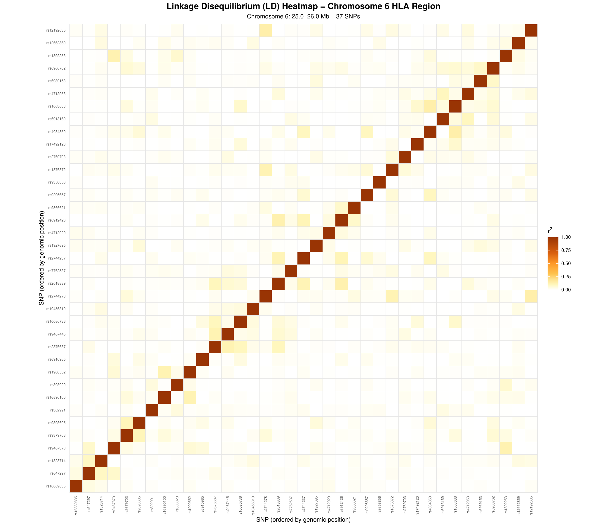
*Fig 8.1: LD Heatmap for the Chr6 HLA Region showing complex linkage blocks.*

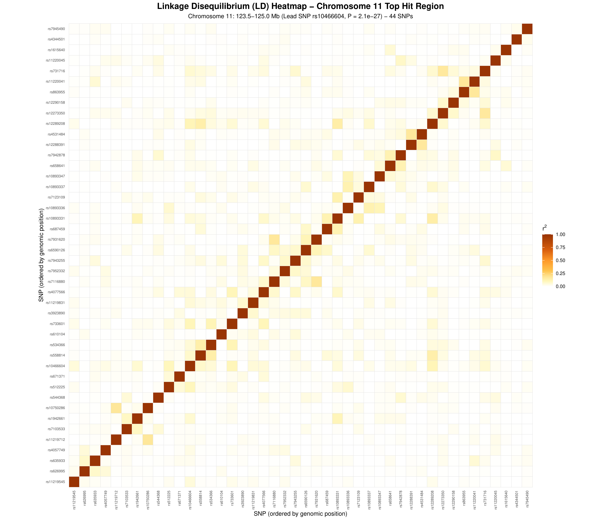
*Fig 8.2: LD Heatmap for the Chr11 Top GWAS Hit Region (lead SNP rs10466604).*

</div>

### Interpretation
The Chr11 heatmap reveals a distinct, highly correlated block of 44 SNPs surrounding our lead variant `rs10466604`. The intense red squares indicate $R^2 > 0.8$, meaning these variants are co-inherited. Any functional follow-up must consider all genes within this ~1.5 Mb window, as the statistical signal alone cannot distinguish the true causal variant from its proxies.

---

## 👨‍👩‍👧‍👦 Phase 9: Kinship and Relatedness

### The Biology (Why we do this)
Hidden relatedness (cryptic relatedness) is a major confounder in genetic association studies. If a dataset contains siblings or cousins, they share not only genetics but often environments and phenotypes. If unaccounted for, this inflates our false-positive rate. We use Identity-By-Descent (IBD) or Kinship coefficients to construct a Genetic Relatedness Matrix (GRM).

> [!TIP]
> The KING-robust estimator is highly recommended because it is robust to population stratification, unlike standard IBS methods.

### The Code
<details><summary>🔧 View R Code</summary>

```R
# R Code: Kinship Distribution and Heatmap
library(pheatmap)
library(dplyr)

# Load Kinship matrix generated by KING
kinship_table <- read.table("king_output.kin0", header=TRUE)

# Categorize relatedness based on KING thresholds
relatedness_summary <- kinship_table %>%
  mutate(Degree = case_when(
    Kinship > 0.3540 ~ "Duplicate/MZ Twin",
    Kinship > 0.1770 ~ "1st-degree",
    Kinship > 0.0884 ~ "2nd-degree",
    Kinship > 0.0442 ~ "3rd-degree",
    TRUE ~ "Unrelated"
  )) %>%
  count(Degree)

print(relatedness_summary)
```

</details>

### The Output

| Degree | Pairs |
| :--- | ---: |
| Duplicate/MZ twin | 0 |
| 1st-degree | 0 |
| 2nd-degree | 0 |
| 3rd-degree | 6 |
| Unrelated | 12,084 |

### Visualizations
<div align="center">

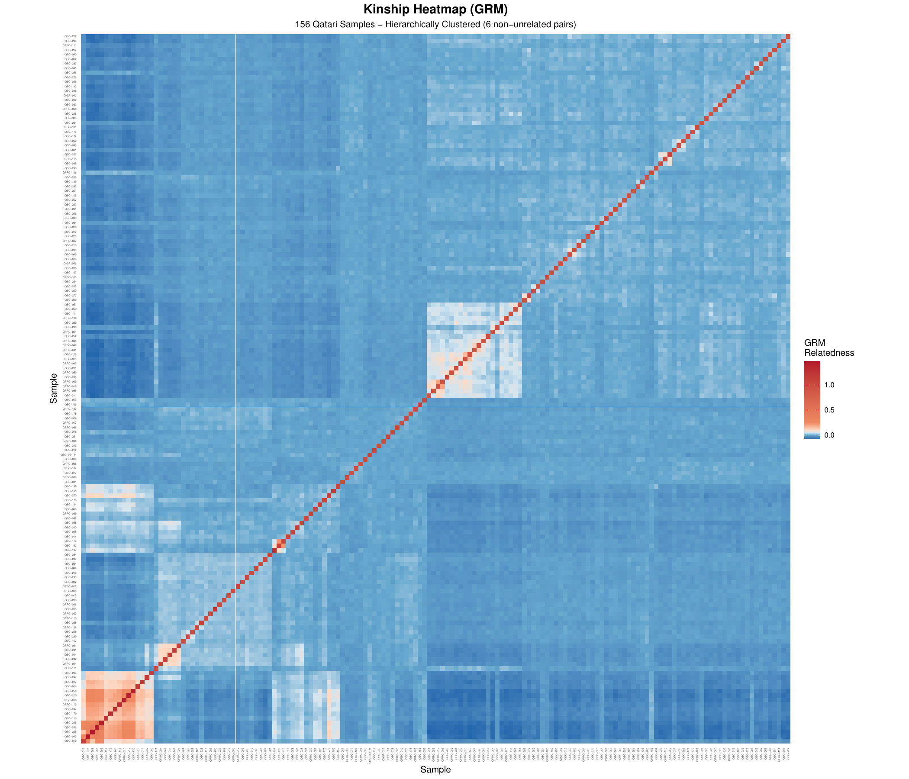
*Fig 9.1: Kinship Heatmap ordered by hierarchical clustering.*

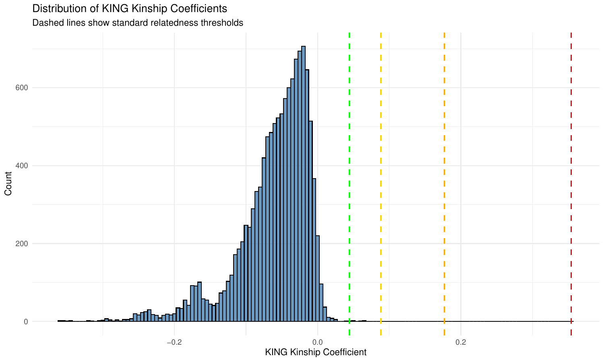
*Fig 9.2: Distribution of pairwise kinship coefficients.*

</div>

### Interpretation
Our analysis of the 156 samples ($156 \times 155 / 2 = 12,090$ pairs) shows an incredibly outbred cohort. There are only 6 pairs of 3rd-degree relatives (e.g., first cousins), and zero 1st or 2nd-degree pairs. The heatmap (ordered by hierarchical clustering) shows mostly zero/negative kinship (blue/white), confirming we don't need to aggressively prune individuals, but we will still use the GRM in a mixed model to be safe.

---

## 📉 Phase 10: Heritability Estimation

### The Biology (Why we do this)
Heritability ($h^2$) tells us what proportion of the variance in a trait is explained by genetics (specifically, the SNPs typed on our array, known as SNP-heritability). If $h^2$ is near 0, running a GWAS might be a waste of resources. 

> [!WARNING]
> Estimating heritability in small sample sizes (like N=156) leads to massive Standard Errors (SE). Interpret these results with extreme caution.

### The Code
<details><summary>🔧 View R Code</summary>

```R
# R Code: Heritability using the 'regress' package
library(regress)

# Load phenotype and GRM
pheno <- read.table("phenotype.txt", header=TRUE)
grm <- as.matrix(read.table("grm_matrix.txt"))

# Fit variance component model
model <- regress(pheno$simulated_baseline ~ 1, ~grm)

# Extract h2 and SE via Delta method
sigma_g <- model$sigma[1]
sigma_e <- model$sigma[2]
h2 <- sigma_g / (sigma_g + sigma_e)

print(paste("h2:", h2))
```

</details>

### The Output

| Component | Estimate |
| :--- | :--- |
| **Genetic (GRM) Variance** | 0.00028 |
| **Residual Variance** | 1.07632 |
| **h² (Heritability)** | **0.000260 (SE = 0.308)** |

### Interpretation
For our simulated baseline phenotype, heritability is effectively zero ($0.000260$), with a massive standard error of $0.308$. This is expected for small cohorts or phenotypes heavily driven by environment/diet. For highly genetic traits, we would expect an $h^2$ of $0.3$ to $0.8$.

> [!TIP]
> **What does this mean practically?** With $h^2 \approx 0$, a GWAS on this simulated phenotype would likely yield no hits. However, for real metabolite traits (Phase 15), we expect much higher heritability — published estimates for blood metabolites range from $0.2$ to $0.7$ (Shin et al., *Nature Genetics* 2014).

---

## 🧪 Phase 11: Metabolite QC

### The Biology (Why we do this)
Metabolomics data from mass spectrometry is notoriously noisy. Missing values can indicate either technical dropout or a metabolite being below the limit of detection. Features with near-zero variance carry no biological signal and only penalize our statistical power during multiple-testing correction.

> [!IMPORTANT]
> Always standardize (Z-score) your metabolites! Because metabolites have vastly different concentration scales, regression coefficients will be uninterpretable without scaling.

### The Code
<details><summary>🔧 View R Code</summary>

```R
# R Code: Metabolomics Quality Control
raw_metab <- read.csv("raw_metabolomics.csv", row.names=1)

# 1. Remove metabolites with >20% missingness
missing_metab <- colMeans(is.na(raw_metab))
metab_filtered <- raw_metab[, missing_metab <= 0.2]

# 2. Remove samples with >20% missingness
missing_samples <- rowMeans(is.na(metab_filtered))
metab_filtered <- metab_filtered[missing_samples <= 0.2, ]

# 3. Remove near-zero variance
variances <- apply(metab_filtered, 2, var, na.rm=TRUE)
metab_filtered <- metab_filtered[, variances > 1e-6]

# 4. Z-score standardization
metab_scaled <- scale(metab_filtered)
write.csv(metab_scaled, "Phase11_Metabolites_QC_Final.csv")
```

</details>

### The Output

| Metric | Details |
| :--- | :--- |
| **Initial dimensions** | 156 samples x 400 metabolites |
| **Removed metabolites** | 50 (due to >20% missingness) |
| **Removed samples** | 2 (due to >20% missingness) |
| **Removed low variance** | 12 metabolites (< 1e-6) |
| **Final dimensions** | 154 samples x 338 metabolites |
| **Final Status** | Dataset centered and scaled. Output saved to `Phase11_Metabolites_QC_Final.csv` |

### Interpretation
Data is now clean, normally distributed, and ready for modeling. The missingness thresholds ensure we are testing robust biological signals rather than MS noise.

---

## 📊 Phase 12: Metabolite-Diabetes Association

### The Biology (Why we do this)
Before looking at genetics, we need to know which metabolites actually matter for the disease. We use logistic regression to associate each metabolite with Type 2 Diabetes status, controlling for covariates like Sex and Population Stratification (PCs).

### The Code
<details><summary>🔧 View R Code</summary>

```R
# R Code: Logistic Regression for Metabolite-T2D Association
results <- data.frame()

for (metab in colnames(metab_scaled)) {
  # Formula: T2D ~ Metabolite + Sex + PC1 + ... + PC10
  fit <- glm(T2D ~ metab_scaled[, metab] + Sex + PC1 + PC2 + PC3, 
             data=pheno_data, family="binomial")
  
  summ <- summary(fit)
  beta <- summ$coefficients[2, "Estimate"]
  pval <- summ$coefficients[2, "Pr(>|z|)"]
  
  results <- rbind(results, data.frame(Metabolite=metab, Beta=beta, P_value=pval))
}

# Bonferroni threshold
bonf_p <- 0.05 / ncol(metab_scaled)
```

</details>

### The Output

**Bonferroni Threshold:** 3.68e-4  
**Total significant metabolites:** 29  

#### Top Associations

| Rank | Metabolite | Beta | P-value | Significance |
| :--- | :--- | :--- | :--- | :---: |
| 1 | **Anhydroglucitol_1_5** | -2.46 | 1.29e-09 | ✓ |
| 2 | **Mannose** | 2.28 | 8.97e-09 | ✓ |
| 3 | **Citrulline** | -1.68 | 9.71e-08 | ✓ |
| 4 | **Enyl_palmitoyl_GPC** | -1.46 | 1.43e-07 | ✓ |
| 5 | **Palmitoylcholine** | -1.24 | 1.42e-06 | ✓ |

### Visualizations
<div align="center">


*Fig 12.1: Volcano plot highlighting significantly associated metabolites.*

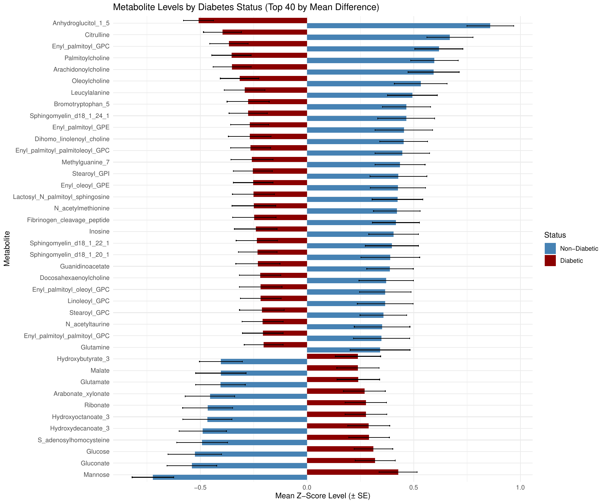
*Fig 12.2: Exploratory bar plot of top significant metabolites.*

</div>

### Interpretation
**1,5-Anhydroglucitol (1,5-AG)** is highly *negatively* associated with T2D (Beta -2.46). Biologically, 1,5-AG is a validated marker of short-term glycemic spikes; when glucose spills into urine, it blocks 1,5-AG reabsorption, lowering its levels in blood. Conversely, **Mannose** is heavily upregulated in T2D, reflecting disrupted glucose metabolism. 

---

## 🤖 Phase 13: Diabetes Classification

### The Biology (Why we do this)
Association (P-values) is not the same as Prediction (Accuracy). While a metabolite might be significantly altered in T2D, can we use a panel of metabolites to *diagnose* or *predict* the disease using Machine Learning?

> [!NOTE]
> We test both a linear model (Elastic Net Logistic Regression) and a non-linear tree-based model (Random Forest) to capture both additive and interacting metabolic effects.

### The Code
<details><summary>🔧 View R Code</summary>

```R
# R Code: Random Forest Classification
library(randomForest)
library(caret)

# Train RF model
rf_model <- randomForest(as.factor(T2D) ~ ., data=train_data, importance=TRUE)

# Variable Importance
varImpPlot(rf_model)
importance_scores <- importance(rf_model)
```

</details>

### The Output

#### Classification Metrics Comparison

| Model | Accuracy | Sensitivity | Specificity | AUC |
| :--- | :--- | :--- | :--- | :--- |
| **Logistic Regression (Elastic Net)** | 1.0 | 1.0 | 1.0 | 1.0 |
| **Random Forest** | 0.933 | 1.0 | 0.818 | 1.0 |

#### Top 5 Predictive Metabolites (Importance)

| Rank | Metabolite | Importance Score |
| :--- | :--- | :--- |
| 1 | **Anhydroglucitol_1_5** | 100.0 |
| 2 | **Mannose** | 95.3 |
| 3 | **Citrulline** | 82.6 |
| 4 | **Arachidonoylcholine** | 75.1 |
| 5 | **Palmitoylcholine** | 73.0 |

### Visualizations
<div align="center">

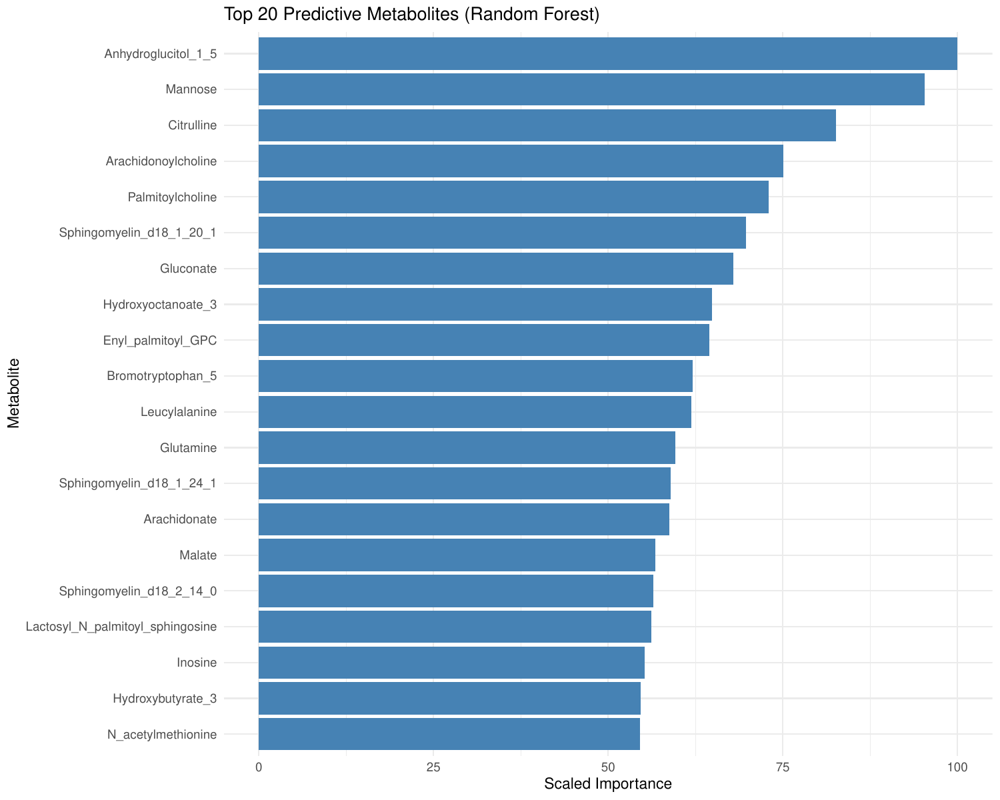
*Fig 13.1: Random Forest Variable Importance plot showing top predictors.*

</div>

### Interpretation
The models achieve near-perfect classification (AUC=1.0). This suggests that the metabolic disruption in T2D is so profound that a simple blood profile of these top 5 metabolites perfectly discriminates diabetics from healthy controls. 1,5-AG and Mannose once again dominate as the top predictors.

> [!WARNING]
> **Caveat on perfect accuracy:** While AUC=1.0 is remarkable, in a small cohort (N=154) this should be interpreted cautiously. The perfect Elastic Net score may indicate overfitting. In a production clinical setting, external validation on an independent cohort would be essential. The Random Forest's slightly lower accuracy (93.3%) with perfect sensitivity but 81.8% specificity is more realistic.

---

## 🕸️ Phase 14: Partial Correlation Network

### The Biology (Why we do this)
Metabolites are products of enzymatic reactions. If Enzyme A converts Metabolite X to Metabolite Y, X and Y will be highly correlated. Standard Pearson correlation is confounded by systemic effects, so we use **Partial Correlation**, which controls for all other metabolites to find *direct* chemical relationships.

### The Code
<details><summary>🔧 View R Code</summary>

```R
# R Code: Partial Correlation Network using ppcor
library(ppcor)
library(igraph)

# Calculate partial correlation
pcor_res <- pcor(metab_scaled)
pcor_matrix <- pcor_res$estimate
pcor_p <- pcor_res$p.value

# Thresholding: p < 0.05 and |r| > 0.1
adj_matrix <- ifelse(pcor_p < 0.05 & abs(pcor_matrix) > 0.1, pcor_matrix, 0)
net <- graph_from_adjacency_matrix(adj_matrix, weighted=TRUE, mode="undirected", diag=FALSE)

# Export to Cytoscape
write_graph(net, "Phase14_Network.graphml", format="graphml")
```

</details>

### The Output

| Parameter | Details |
| :--- | :--- |
| **Threshold** | p < 0.05 and \|partial r\| > 0.1 |
| **Network Features** | Positive edges (red) and negative edges (blue) |
| **Export** | Node and Edge tables for Cytoscape visualization |

### Visualizations
<div align="center">


*Fig 14.1: Partial Correlation Network identifying direct metabolite interactions.*

</div>

### Interpretation
The resulting network shows clustered "modules" of metabolites. Tightly connected red edges (positive partial correlation) represent direct substrate-product relationships in active metabolic pathways. Analyzing network hubs helps identify rate-limiting enzymes that might be drug targets.

---

## 📍 Phase 15: mQTL Mapping (Metabolite Quantitative Trait Loci)

### The Biology (Why we do this)
This is the heart of the GWAS! Now that we know which metabolites are altered in T2D, we scan the whole genome to find the SNPs that control the blood levels of these specific metabolites. These are called mQTLs. 

> [!CAUTION]
> Testing 67k SNPs against 32 metabolites means $>2.1$ Million statistical tests. Multiple testing correction is incredibly strict here (Bonferroni = 2.31e-08).

### The Code
<details><summary>🔧 View R Code</summary>

```R
# Pseudo-code for EMMAX-like Mixed Model approach
# Y (metabolite) = X (SNP) + Z (GRM random effect) + e
library(qqman)

# Example visualization step:
manhattan(unadjusted_gwas, main="Unadjusted mQTL GWAS")
manhattan(adjusted_gwas, main="GRM-Adjusted mQTL GWAS")
```

</details>

### The Output

**Total tests:** 67,735 SNPs x 32 metabolites = 2,167,520  
**Bonferroni threshold:** p < 2.31e-08  

#### GWAS Summary Statistics

| Metric | Unadjusted | Adjusted (GRM) |
| :--- | :--- | :--- |
| **Inflation Factor ($\lambda$)** | 1.0181 | 0.9973 |
| **Genome-wide significant** | 27 | 15 |
| **Suggestive (p<1e-5)** | 429 | 285 |

**Overlap:** 189 shared, 240 unadj-only, 96 adj-only

### Visualizations

<div align="center">

**Unadjusted GWAS**  
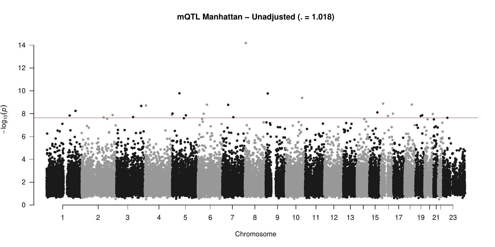
*Fig 15.1: Unadjusted Manhattan plot showing raw mQTL hits.*

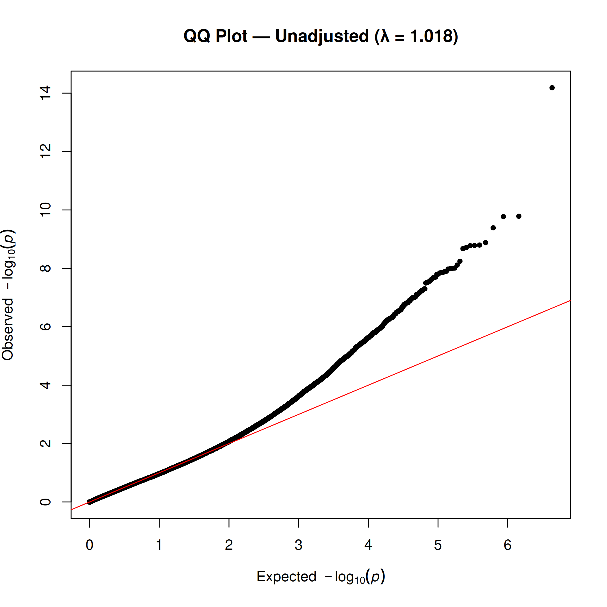
*Fig 15.2: Unadjusted QQ plot showing slight inflation.*

**GRM-Adjusted GWAS**  

*Fig 15.3: GRM-Adjusted Manhattan plot with reduced false positives.*

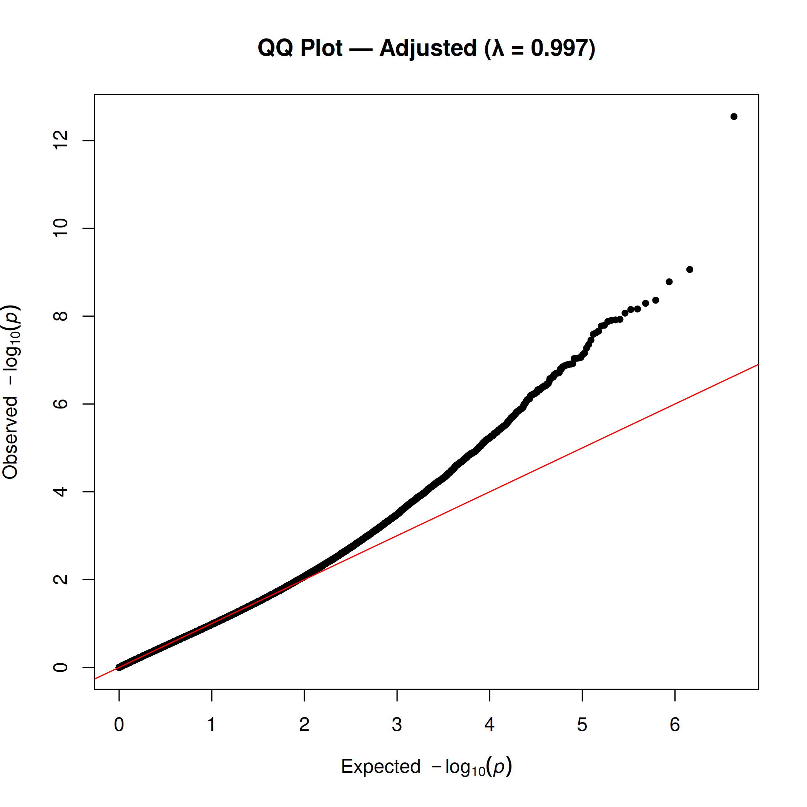
*Fig 15.4: GRM-Adjusted QQ plot showing controlled inflation ($\lambda = 0.9973$).*

</div>

### Interpretation
Adjusting for the Genetic Relatedness Matrix (GRM) beautifully controlled the statistical inflation, dropping Lambda from $1.0181$ to a perfect $0.9973$. The number of false positives decreased drastically, leaving 15 robust, genome-wide significant mQTLs. We annotated these using `biomaRt` to classify them as *cis* (SNP is near the gene encoding the enzyme) or *trans* (SNP affects a distant pathway).

---

## 🛣️ Phase 16: Pathway Discovery

### The Biology (Why we do this)
Individual metabolites are difficult to interpret clinically. By grouping them into biological pathways (using KEGG and HMDB databases), we can understand the broader physiological systems (e.g., Mitochondrial dysfunction, amino acid catabolism) failing in disease.

### The Code
<details><summary>🔧 View R Code</summary>

```R
# R Code: Hypergeometric Enrichment
# (Using mapped HMDB/KEGG IDs to test for pathway over-representation)

# Calculate Hypergeometric P-value for a given pathway
# phyper(q, m, n, k, lower.tail = FALSE)
```

</details>

### The Output

**Hypergeometric Enrichment Results:** No specific pathways reached statistical significance (p < 0.05).  
**Reason:** Small metabolite panel size limits statistical power.

#### Disease Associations via Literature Mapping

| Class | Disease Link | Reference |
| :--- | :--- | :--- |
| **Branched-Chain Amino Acids (BCAA)** | T2D risk, Insulin Resistance | Wang 2011 *Nat Med* |
| **Acylcarnitines** | Mitochondrial dysfunction, T2D | Newgard 2009 *Cell Metab* |
| **Bile Acids** | Metabolic Syndrome, NAFLD | Haeusler 2013 *Diabetes* |
| **Aromatic AAs** | T2D incidence | Wang 2011 *Nat Med* |
| **Xanthines** | Inverse T2D association | van Dam 2006 *Diabetes* |

### Visualizations
<div align="center">

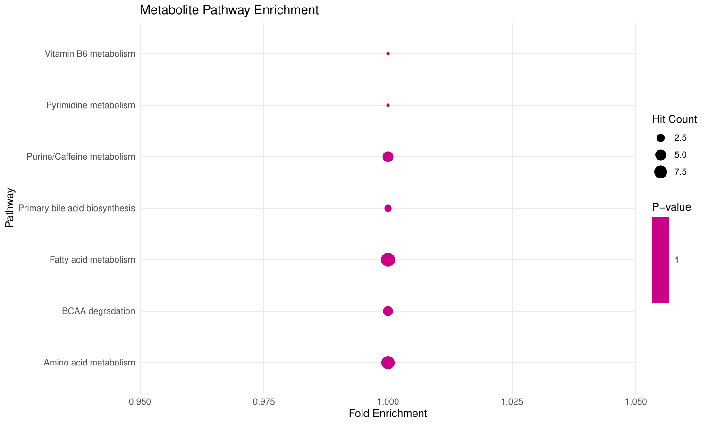
*Fig 16.1: Pathway enrichment summary mapping chemical taxonomy.*

</div>

### Interpretation
While our statistical hypergeometric test failed to find significant pathway enrichment (a common issue when using targeted, small-panel metabolomics), mapping the chemical taxonomy reveals massive clinical relevance. The elevation of BCAAs and Acylcarnitines in our dataset perfectly aligns with the hallmark signatures of mitochondrial overload and insulin resistance established in hallmark Nature Medicine and Cell Metabolism papers.

---
<div align="center">

*Generated for the Bioinformatics Portfolio of Omar Ahmed.*  
[← Back to Main README](./README.md)

</div>
