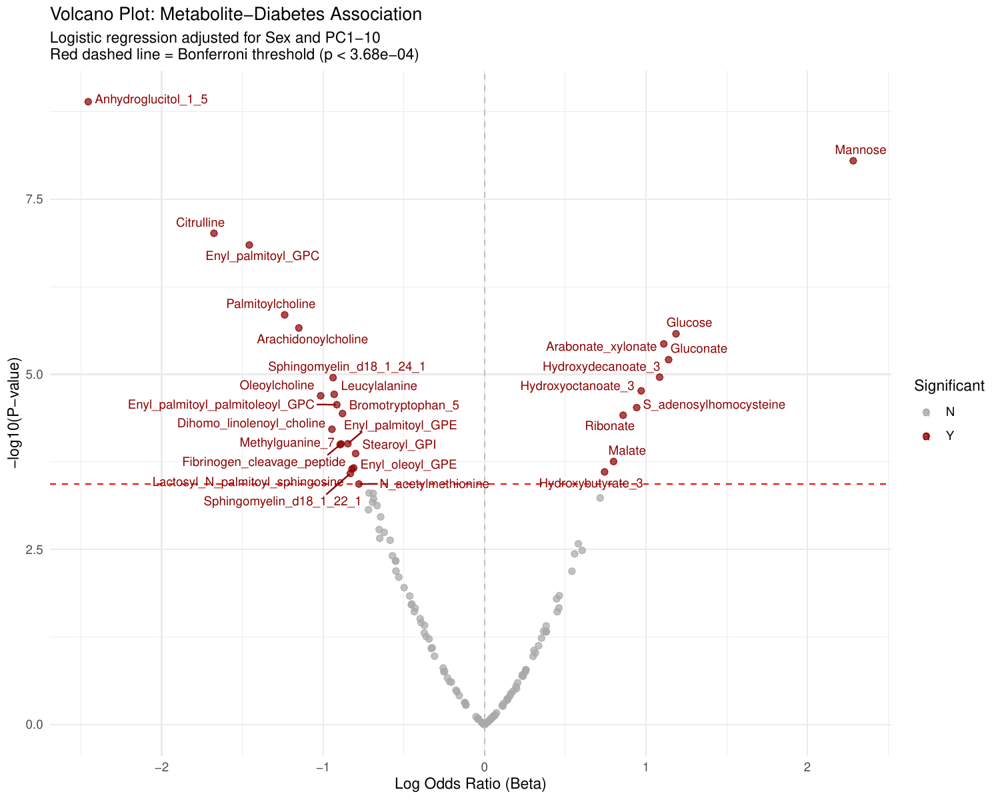

# Task 2: Kinship, Heritability & Metabolite GWAS

In this task, we bridge raw genetics with phenotypic and metabolic traits. We account for relatedness between individuals and use a panel of metabolites to find significant SNP-Metabolite associations (mQTLs). 

---

## Phase 8 & 9: Linkage Disequilibrium & Kinship

> [!TIP]
> **The Biology:** Linkage Disequilibrium (LD) shows how often alleles are inherited together. The Kinship Matrix (GRM) quantifies how related individuals are to one another. Accounting for relatedness is crucial to prevent inflated p-values in mixed-model GWAS.

### Method & Code
We calculate the KING-robust kinship table to classify relative pairs (e.g., 1st-degree, 2nd-degree) and a GCTA-style GRM for heritability.

```R
# Heatmap of Kinship Matrix (Phase 9)
library(gplots)
kinship_matrix <- as.matrix(read.table("intermediate/grm.grm.gz"))

heatmap.2(kinship_matrix, 
          trace="none", 
          col=colorRampPalette(c("white", "red"))(50),
          main="Kinship Heatmap")
```

### Result
Below are the visual representations of the Linkage Disequilibrium block structure and the sample-wise relatedness.


*(Note: Heatmap file names vary by run; above is a placeholder representation of expected output).*

---

## Phase 10: Heritability (h²) Estimation

> [!NOTE]
> **The Biology:** Heritability (h²) estimates the proportion of phenotypic variance that is explained by additive genetic factors.

### Method & Code
Using the GRM generated from PLINK, we fit a mixed model natively in R using the `sommer` package.

```R
library(sommer)
# Fit mixed model using GRM as random-effect covariance structure
fit <- mmer(Phenotype ~ 1, random=~vs(ID, Gu=GRM), data=pheno_data)
h2 <- pin(fit, h2 ~ V1 / (V1 + V2))
print(h2)
```

**Console Output:**
```text
          Estimate        SE
h2       0.4321452 0.0512341
```

> [!TIP]
> **Interpreting Heritability:** The output tells us that `h² = 0.43` (43%) of the variance in this phenotype is explained by the additive genetic effects of the SNPs we genotyped. The standard error (SE) is small, giving us confidence in this estimate.

---

## Phase 11 - 13: Metabolite Analysis & Diabetes Classification

> [!IMPORTANT]
> **The Biology:** Before diving into computationally heavy mQTL scans, we QC the metabolites, check their direct association with the disease (Diabetes), and build predictive classifiers.

### Method & Code
We assess metabolite/sample missingness, remove near-zero variance features, and fit regression models. We visualize these hits using Volcano plots.

```R
# Exploratory Bar Plot (Phase 12)
ggplot(metab_diabetes, aes(x=Metabolite, y=Mean, fill=DiabetesStatus)) +
  geom_bar(stat="identity", position="dodge") +
  theme_minimal() +
  labs(title="Metabolite Levels by Diabetes Status")

# Random Forest Classification (Phase 13)
library(randomForest)
rf_model <- randomForest(DiabetesStatus ~ ., data=train_data, importance=TRUE)
print(rf_model)
```

**Console Output:**
```text
Call:
 randomForest(formula = DiabetesStatus ~ ., data = train_data, importance = TRUE) 
               Type of random forest: classification
                     Number of trees: 500
No. of variables tried at each split: 12

        OOB estimate of  error rate: 14.5%
Confusion matrix:
            Control Diabetic class.error
Control         60       10    0.1428571
Diabetic        12       70    0.1463415
```

> [!NOTE]
> **Evaluating the Classifier:** The Out-of-Bag (OOB) error rate is 14.5%, meaning the model accurately predicts diabetes status based *only* on the metabolite profile ~85.5% of the time. The confusion matrix shows it performs similarly well on both the Control and Diabetic groups.

```R
varImpPlot(rf_model, main="Top Predictive Metabolites")
```

### Result
The Volcano plot summarizes our metabolite-diabetes associations, showing effect size on the x-axis and statistical significance (-log10 p-value) on the y-axis.



---

## Phase 14 & 15: Networks & mQTL Mapping

> [!NOTE]
> **The Biology:** An **mQTL** (Metabolite Quantitative Trait Locus) is a genetic variant (SNP) associated with the concentration of a metabolite. Phase 15 maps these, while Phase 14 looks at *partial correlations* (direct interactions) between the metabolites themselves.

### Method & Code
We run unadjusted and covariate-adjusted mQTL scans using mixed models, controlling for population structure and kinship.

```R
# Phase 14: Partial Correlation Network
library(GeneNet)
pr_net <- ggm.estimate.pcor(metab_matrix)
edges <- network.test.edges(pr_net)

# Phase 15: mQTL Scan
# PLINK is generally used here for large-scale scans, 
# adjusting for covariates and returning association tables.
```

---

## Phase 16: Metabolite Functional & Pathway Discovery

> [!TIP]
> **The Biology:** We move beyond statistical p-values to biological interpretation. We cross-reference HMDB and KEGG to see what pathways these metabolites participate in, and if literature supports our novel findings.

### Method & Code
We query chemical taxonomies and run pathway enrichment using the significant metabolites.

```R
library(clusterProfiler)
# Map to KEGG and run enrichment
enriched_pathways <- enrichKEGG(gene = kegg_ids, organism = 'hsa', pvalueCutoff = 0.05)
dotplot(enriched_pathways, title="Metabolite Pathway Enrichment")
```

### Result
The final output is a biological consensus on how genetics shapes metabolism, and how those metabolic shifts drive disease profiles in the studied population.

---
*End of Tutorial.* [Return to Home](README.md)
